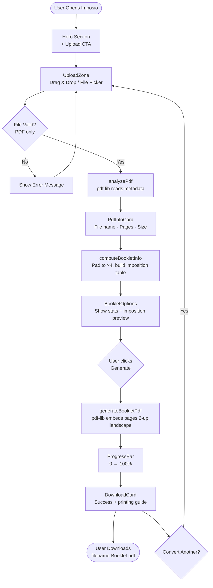
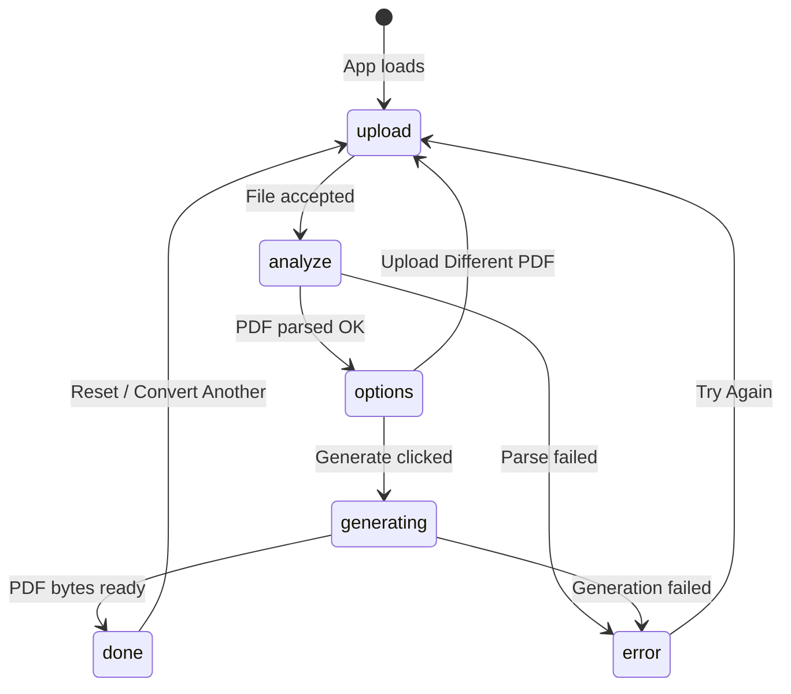
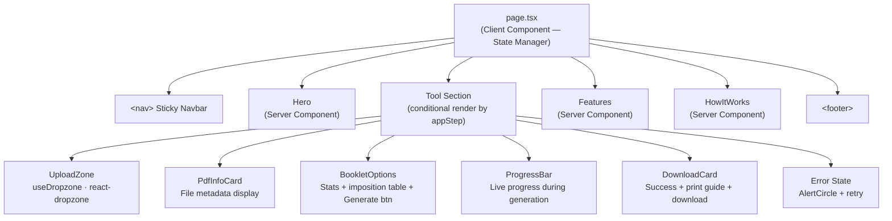
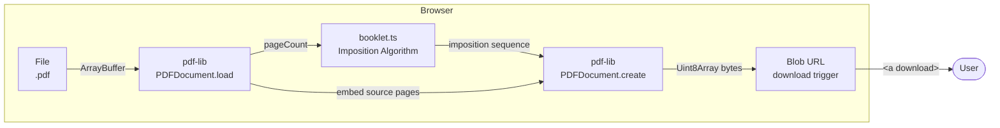
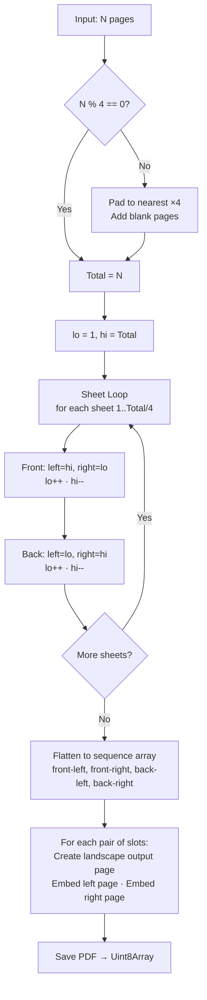

# Imposio

> Convert any PDF into a print-ready booklet in seconds — entirely in your browser.

[](./CHANGELOG.md)
[](./LICENSE)
[](https://nextjs.org)
[](https://www.typescriptlang.org)

---

## What is Imposio?

**Imposio** is a client-side PDF booklet imposition tool. It takes any PDF and rearranges its pages into the correct print order so that when you print duplex, fold, and bind the sheets, the result is a properly-sequenced booklet.

### The Problem

A standard PDF with pages `1, 2, 3, 4, 5, 6, 7, 8` cannot simply be printed "2-up" (2 pages per sheet) and folded into a booklet — the page order would be wrong.

### The Solution

Imposio applies the **booklet imposition algorithm** to re-order the pages:

| Sheet | Front (Left \| Right) | Back (Left \| Right) |
|---|---|---|
| 1 | 8 \| 1 | 2 \| 7 |
| 2 | 6 \| 3 | 4 \| 5 |

After duplex printing and folding, the booklet reads `1 → 2 → 3 → 4 → 5 → 6 → 7 → 8` correctly.

**Everything runs in the browser. No files are ever uploaded.**

---

## Features

| Feature | Detail |
|---|---|
| ✅ Automatic Imposition | Correct booklet page order for any PDF length |
| ✅ Blank Page Padding | Auto-pads to nearest multiple of 4 |
| ✅ Quality Preservation | Fonts, images, vectors, and text intact |
| ✅ Privacy First | 100% client-side, zero server contact |
| ✅ No Watermarks | Clean output PDFs |
| ✅ Duplex Ready | Landscape layout, one sheet = two pages |
| ✅ Progress Tracking | Live generation progress bar |
| ✅ Instant Download | `filename-Booklet.pdf` with one click |

---

## Architecture

### High-Level Flow



---

### Application State Machine



---

### Component Architecture



---

### Library & Data Flow



---

### Booklet Imposition Algorithm



---

## Project Structure

```
imposio/
├── src/
│   ├── app/
│   │   ├── layout.tsx          # Root layout — Inter font, SEO metadata
│   │   ├── page.tsx            # Main page — full workflow state machine
│   │   └── globals.css         # Tailwind v4 import + design tokens
│   │
│   ├── components/
│   │   ├── Hero.tsx            # Landing hero section
│   │   ├── Features.tsx        # 4-card feature grid
│   │   ├── HowItWorks.tsx      # 4-step numbered guide
│   │   ├── UploadZone.tsx      # Drag & drop PDF input
│   │   ├── PdfInfo.tsx         # PDF metadata display card
│   │   ├── BookletOptions.tsx  # Booklet stats + imposition preview
│   │   ├── ProgressBar.tsx     # Animated progress bar
│   │   └── DownloadCard.tsx    # Success + download + print instructions
│   │
│   ├── lib/
│   │   ├── booklet.ts          # Core imposition algorithm
│   │   └── pdf-utils.ts        # PDF analysis, generation, download utils
│   │
│   └── types/
│       └── pdf.ts              # TypeScript interfaces & types
│
├── public/                     # Static assets
├── CHANGELOG.md                # Version history
├── package.json                # Dependencies & scripts
├── next.config.ts              # Next.js configuration
├── tsconfig.json               # TypeScript config
└── postcss.config.mjs          # Tailwind v4 PostCSS plugin
```

---

## Tech Stack

| Technology | Version | Role |
|---|---|---|
| [Next.js](https://nextjs.org) | 16.2.7 | Framework (App Router) |
| [TypeScript](https://www.typescriptlang.org) | ^5 | Type safety |
| [Tailwind CSS](https://tailwindcss.com) | ^4 | Styling |
| [pdf-lib](https://pdf-lib.js.org) | ^1.17.1 | PDF read + generate |
| [react-dropzone](https://react-dropzone.js.org) | ^15.0.0 | Drag & drop file input |
| [lucide-react](https://lucide.dev) | ^1.17.0 | Icon set |
| React | 19.2.4 | UI runtime |

---

## Getting Started

### Prerequisites

- Node.js ≥ 18
- npm ≥ 9

### Install

```bash
git clone https://github.com/your-org/imposio.git
cd imposio
npm install
```

### Run Development Server

```bash
npm run dev
```

Open [http://localhost:3000](http://localhost:3000).

### Build for Production

```bash
npm run build
npm run start
```

---

## How to Use

1. **Open** Imposio in your browser
2. **Upload** any PDF by dragging & dropping or clicking "Choose PDF"
3. **Review** the detected page count and auto-calculated booklet layout
4. **Click** "Generate Booklet PDF" and wait for processing
5. **Download** the output `filename-Booklet.pdf`
6. **Print** duplex (both sides), fold in half, and bind — done!

---

## PDF Handling

Imposio correctly handles:

- Any page count (odd, even, or already a multiple of 4)
- Portrait and landscape source pages
- PDFs with embedded images, fonts, and vector graphics
- Large PDFs (progress bar shows generation status)

Limitations in v0.1.0:

- Encrypted/password-protected PDFs are not supported
- Mixed page sizes use the first page as the reference dimension

---

## Privacy

Imposio processes files **entirely in the browser** using `pdf-lib`. No file data is ever sent to a server, stored, or logged. The app works fully offline after the initial page load.

---

## Roadmap

Planned features for future versions:

- [ ] Booklet page preview before download
- [ ] Custom margin and bleed support
- [ ] Crop and registration marks
- [ ] Signature booklet mode (multi-section)
- [ ] PDF Merge tool
- [ ] PDF Split tool
- [ ] N-Up printing layout
- [ ] PDF Compress
- [ ] PDF Rotate pages

---

## License

MIT © 2026 Imposio
